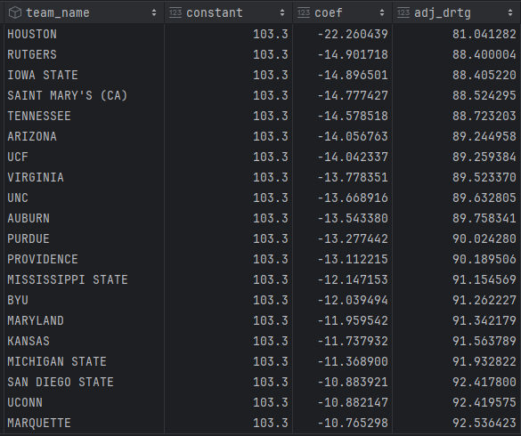

# Adjusting Basketball Stats

$\huge ORTG = \beta_{0} + \beta_{1}tm_{1}ORTG + \beta_{2}tm_{2}DRTG + \varepsilon $

# What am I trying to accomplish?

I love data, basketball and math.  The order in which I presented those likely is reflective of the order.  When I get an opportunity to combine my love of all 3, I can't help myself.

Team talent disparity and schedule disparity are two significant issues to solve for in college sports.  These issues are far less relevant in the world of professional sports as parity is exhibited to a match higher degree.  As of writing this in January 2024, there are 362 NCAA Division-1 basketball teams.  Some teams have terrific records but haven't played high-quality opponents, while other teams have worse records but have played very difficult schedules with respect to opponent quality.

Michigan State is a particularly controversial team this season in that their record, as of today, is 14-9.  However, the most reputable college basketball ranking systems still have them ranked fairly high.  KenPom has them ranked 17th overall, Eric Haslam has them ranked 14th overall, Bart Torvik has them ranked 15th overall, and the NCAA NET rankings, which is used to evaluate NCAA tournament seeding has them currently ranked 24th overall.  However, six of their nine losses have come from KenPom top 50 teams.  Additionally, they do have 3 *dominant* wins over KenPom top 40 teams.  The picture becomes a bit more clear as it seems that Michigan State's record is more reflective of the difficulty of their schedule rather than the quality of their team.  Is it possible that Michigan State is a very good team, despite losing some close games?

The goal of this exercise is to help explain and uncover some of the "mystery" which lies in these rankings by making my best attempt at reproducing what others have done.  While a lot of what you'll find in here is far from original, there are a few original (as far as I know) things I've done differently, which I'll outline below in further detail.  Simply put, by creating my own rankings which account of opponent quality and schedule disparity, I believe better understand the *why* and *how* behind seeding and other ranking systems.

# Terminology & brief methodology overview

Before we can dive into the nitty-gritty, it's important to define a few terms.  All the metrics in this process are derived at the "per-possession" level.  Why not the "per-game" level?  It turns out that "per game" stats, while often cited by fans and commentary, are often very misleading.  For example, many would conclude that Team A, who averages 88 points per game is a better offense than Team B, who averages 68 points per game.  It turns out that not all *games* are created equal.  Perhaps Team A has played several overtime games, maybe a double overtime game?  

Additionally, some teams stylistically look to score often in transition if they have the personnel to do so (Alabama, Arizona) while other teams prefer to play slowly, often in an effort to limit the opposing team's possessions.  As of today, the possession differential between the fastest-playing team and the slowest playing team is 15.5 possessions per game.  That's 15.5 more opportunities to score, create an assist, grab an offensive rebound, draw a foul, turn the ball over, or go to the free throw line.  For the rest of this project, and offense referred to as "good" means that they score a high number of points **per possession**.  A defense that's referred to as "good" means that they allow their opponents to score a low number of points **per possession**.  This mitigates any inflating or deflating of numbers as a result of pace.  Point scored per possession multiplied by 100 will intuitively reflect the number of points scored per 100 possession.  This will be referred to as **offensive rating**.  Points allowed per 100 possessions will be referred to as **defensive rating**.  Lastly, the difference between offensive rating and defensive rating will be referred to as **net rating** (ORTG - DRTG = NRTG).

The beauty of using offensive and defensive rating is accounting for different styles.  For example, some teams like to press and force turnovers.  Each possession which results in an opponent turnover is a possession that yielded zero points.  Conversely, teams who play less aggressively on defense and focus on forcing their opponents to take tough shots rather than creating turnovers will also likely have many possessions in which their opponent scores zero points.  The route in which they take to get there looks very different, though.  If we compared shooting metrics (FG%,eFG%, etc.) across the two teams, the team which prioritizes turnovers will likely allow a higher percentage shooting as they're playing a defensive scheme which prioritizes turning their opponents over vs forcing low percentage shots.

Ken Pomeroy's methodology attempts to predict offensive and defensive ratings rather than wins or losses.  To add some context, let's revisit Michigan State for a second.  In their game against Minnesota, they scored 0.95 points per possession.  All else equal, if that number had increased minimally to 1.01 points per possession, Michigan State would have won that game.  The same can be said for their game against Illinois, where they scored 1.03 points per possession and would have won if that number were 1.09 PPP, assuming all else equal.  This is how these rankings differ from how most fans view the game.  Rather than a win/loss model, it's a comparison of *expected* efficiency(offensive/defensive rating) to *actual*,. realized efficiency.

To wrap up terminology, I'll define a possession.  I'm using Dean Oliver's tried and true possession estimation, which can be calculated as follows:

$\ Poss \approx \ (FGA - ORB) + TO  + Y(FTA) $

I'll be using the constant value *0.475* for y, which has been shown to be most accurate at the college level.  For a more in-depth understanding of this formula and how it's derived, check out Ken Pomeroy's blog on the subject [here](https://kenpom.com/blog/the-possession/).

## Methodology

To explain the methodology, I'm going to use offensive rating as the metric to be adjusted.  The same concept applies to defensive rating, assist percentage, turnover percentage, or any other per-possession metric.  The underlying assumptions here are that a team's offensive rating is determined by 3 main factors:
 - The team's offensive performance
 - The opponent's defensive performance
 - The location of the game

As an example, let's say Purdue is playing Northwestern at Purdue.  Purdue's offensive performance is assumed to be largely determined by what Purdue attempts to do offensively, how Northwestern chooses to defend (and their ability to execute), and whatever effect Purdue's home court advantage offers.  We can model this in the following formulas:

$ortgPurdue = \beta_{0} + \beta_{1}Purdue + \beta_{2}Northwestern + \beta_{h}HomeCourtAdv + \varepsilon $

$ortgNorthwestern = \beta_{0} + \beta_{1}Northwestern + \beta_{2}Purdue -  \beta_{h}HomeCourtAdv + \varepsilon $

Where
 - $ortgPurdue$ is Purdue's game-specific offensive rating
 - $\beta_{0}$ represents the average season-observed offensive rating
 - $\beta_{1}$ and $\beta_{2}$  represent adjustment factors
 - $\beta_{h}$ represents the difference in expected value attributed to home court advantage
 - $Northwestern$, $Purdue$ and $HomeCourtAdv$ represent dummy variables.
 - $\varepsilon$ represents our error term

We could model these dummy variables very easily as seen below:

And could repeat this for both games in which Purdue & Northwestern played.  Once at Purdue, once at Northwestern:

We could easily create a regression to assess what these $\beta$ values would be for each team and the home court advantage, but this would likely be wildly inaccurate due to only having two games from two teams.  Let's add a third team, Illinois.

We now can see that both Purdue and Northwestern have played Illinois once each.  Purdue played Illinois on a neutral court, so the associated dummy variable value for the *home* column is zero for each team as neither had a home court advantage.  Note, for games that Purdue did not participate in, the value in each column associated with Purdue is zero.  We could now create a *slightly* more meaningful regression to get $\beta$ values associated with each team, but this doesn't take each team's previously-played schedule.

We can expand this methodology out to include *every* game in which a division-1 opponent played another division-1 opponent.  These coefficients will likely be much more meaningful as now the impact of every team is being considered simultaneously.  We are able to mathematically derive $\beta$ values for each team which most closely satisfy each equation, where each equation represents a team's performance within a specific game.

### Interpretation

The beauty of having these coefficients is that we can then roughly estimate how we *expect* a team to perform against any other team on a home, neutral or away court.  It's important to note that these expected values are inherently predictive in that the data used to derive them are based on past performances.  Ken Pomeroy has made this distinction several times in saying his rankings are predictive in nature.  Additionally, we can get a rough idea regarding the "portion" of a team's offensive/defensive rating which can be attributed directly to the team.  For example, Houston had an elite 130 offensive rating against Jackson State.  However, Jackson State is one of the worst defenses in D1 this season, so not all of the "credit" four Houston's performance should be attributed to Houston.  Jackson State played a role in Houston's offensive rating, as well.

Here we have some output representing the top 20 teams in adjusted defense

Here we can see the constant, which represents the average defensive rating, and the coefficient associated with each team.  To walk through the interpretation, let's use Houston as an example.  The coefficient associated with Houston is -22.26.  We can interpret this as follows:

*Based on how each team has performed this season, we can **expect** Houston to allow an average offense (ORTG of 103.3) to score at a rate of 0.81 points per possession* This difference is a 25% reduction in offensive rating which, according to this regression, can be attributed to Houston. 

Now let's look at offense.

To use Purdue (Go Boilermakers!) as an example here, the coefficient of 20.37 associated with Purdue can be interpreted as the *increase in offensive rating, beyond average, we can **expect** Purdue to score against an average defense*.  

Putting it all together with net rating, we have the following:

More or less, this is how KenPom's rankings are determined.  Adjusting stats based on schedule and expressing teams' expected performance as an expected value against an average offensive/defensive team.  These rankings fall fairly close to KenPom's rankings.  Looking at some of these numbers, we can begin to understand how teams win games.  Houston's adjusted defense rating is considerably low, meaning they tend to rely on defensive play rather than the offensive end.  Alabama is a particularly interesting example in that they have the highest adjusted offensive rating of anyone, but their defense isn't even in the top 20.  The high adjusted offensive rating keeps their net rating comparitavely high.  

Another team to note is Michigan State, which these rankings have as ranked 18th.  Is it at all feasible to believe that Michigan State would be *expected* to beat an "average" team by 22 points in a 100-possesion game, but still have a 14-9 record?  I believe so, especially given that many of their losses have been close and have all come against top tier teams.  This is where the methodology, as laid out here, can shine above something like AP Rankings, which are extremely biased, pramarily determined by wins and losses, and are determined by the "eye tests" of media personalities.  These AP rankings carry too much tradition and social pressure, as well.  Once a team is ranked number one, they will *always* remain at number one until they lose a game.  It seems fairly reasonable to assume that another team could rise to that number one spot without the previous number one ranked team losing.  Conversely, the notion that a number one ranked team, upon losing, is no longer deserving of the number one ranking, is equally outrageous.